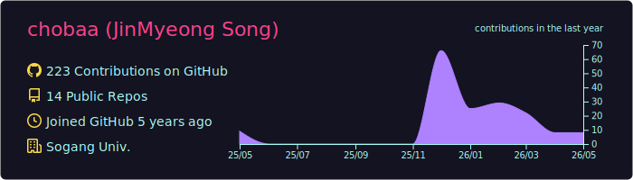
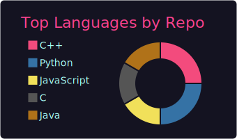
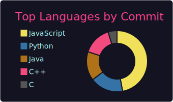
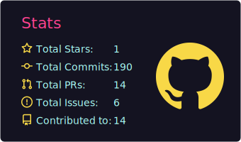

### 👋 Hi there
- 🌱 빠르게 배우고 적응하고자 노력하는 **Backend Server Developer**입니다 🤸
- 📫 **How to reach me:** [jimmy0308@naver.com]

- 💪 **Proficient:** C/C++, Python, FastAPI, PostgreSQL
- ✍️ **Experienced:** AWS EC2/S3, Docker, Flutter, React, SpringBoot

 

### 🏆 Algorithm & Stats

  

