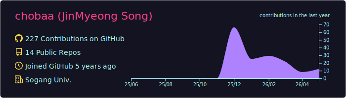
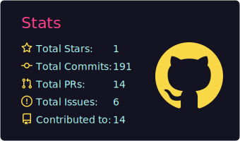
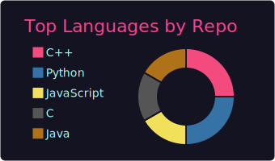

### 👋 Hi there
- 🌱 빠르게 배우고 적응하고자 노력하는 **Backend Server Developer**입니다 🤸
- 📫 **How to reach me:** [jimmy0308@naver.com]
- 📚 **Introduction**: https://www.notion.so/2e0c16bedd3d80e8b594cb2960448b06?source=copy_link
- 💪 **Proficient:** C/C++, Python, FastAPI, PostgreSQL, Springboot
- ✍️ **Experienced:** AWS EC2/S3, Docker, Flutter, Node.js, Unity, UE4, React

 

### 🏆 Algorithm & Stats

  <table align="center">
    <tr>
      <td colspan="2" align="center">
        
      </td>
    </tr>
    <tr>
      <td align="center" width="50%">
        
      </td>
      <td align="center" width="50%">
        
      </td>
    </tr>
    <tr>
      <td colspan="2" align="center">
        
      </td>
    </tr>
  </table>

